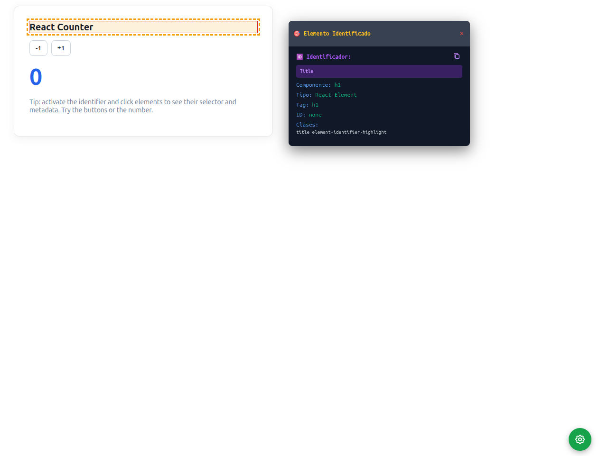

# element-identifier

Generate stable, unique CSS selectors to identify DOM elements — and a Web Component to help you inspect and pick them visually.

## Installation

```bash
npm install element-identifier
```

## Quick Start (Web Component)

Minimal HTML (auto-registers in the browser):

<element-identifier active="false" show-wheel="true" show-panel="true"></element-identifier>

From CDN (for quick demos):

<script type="module" src="https://unpkg.com/element-identifier/dist/index.esm.js"></script>
<!-- now the element is defined: -->
<element-identifier></element-identifier>

### Screenshot




## Web Component (element-identifier)

The project includes a Web Component that shows a floating action button (FAB) and an info panel to help identify DOM elements.

Attributes:
- `show-wheel`: controls whether the wheel (FAB) is shown.
  - `true`, or empty → visible (default)
  - `false`, → hidden
- `active`: controls whether the tool starts activated.
  - `true`/empty → active on start
  - `false` → disabled (default)
- `show-panel`: controls whether the panel can be shown.
  - `true`/empty → the panel will show when an element is selected (default)
  - `false` → the panel remains hidden until you toggle it
- Compatibility: `auto-start` still works as an alias for `active` (supports `true`/`false`).

### Web Component API

You can access the API globally as `elementIdentifier` (global alias) or `window.elementIdentifier`.

Methods:
- `activate()` — enable the tool (starts listening to clicks/hover).
- `deactivate()` — disable the tool and clear highlights.
- `toggle()` — toggle active state.
- `togglePanel()` — show/hide the info panel.
- `showWheel()` — show the floating button menu.
- `hideWheel()` — hide the floating button menu.
- `toggleWheel()` — toggle visibility of the floating button menu.
- `isWheelVisible(): boolean` — return whether the wheel is visible.

Events emitted by the component:
- `activated` — when the tool is activated. detail: `{ timestamp }`.
- `deactivated` — when the tool is deactivated. detail: `{ timestamp }`.
- `element-selected` — when the user clicks an element. detail: `{ element, info }`.
- `copied` — when something is copied via the panel button. detail: `{ text, type }`.

Notes:
- In the browser console you can call `elementIdentifier.activate()` directly without the `window` prefix. A global alias is injected for convenience. `window.elementIdentifier` also works.

## Examples

- React Counter: examples/react-counter
  - One-liner:
    - npm run example:react-counter
      - This will build the library, copy dist into the example, and start a local static server. Open the printed URL.
  - Manual steps:
    1. npm install
    2. npm run build
    3. Serve the examples/react-counter folder (for example: `npx serve examples/react-counter`) and open your browser.

## License

MIT © Joo Herrera
